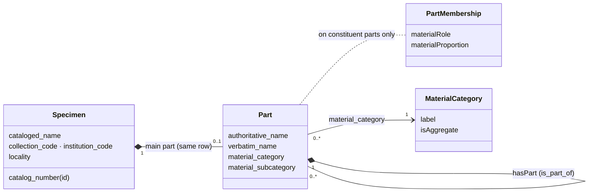
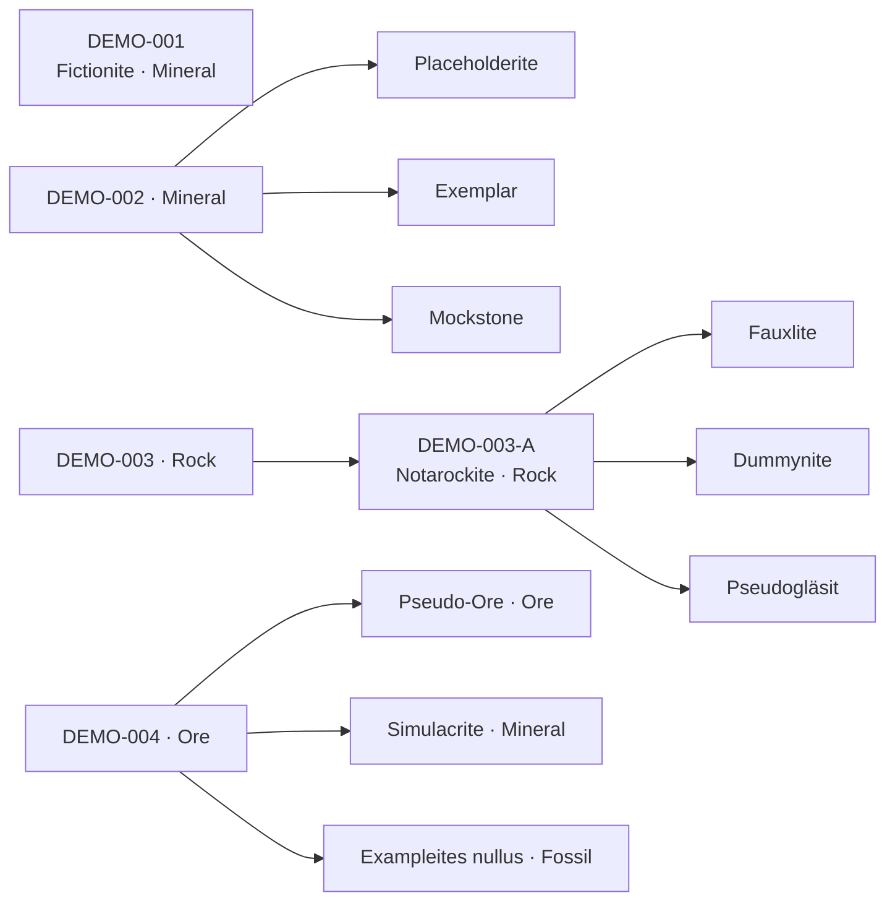

# Compound Specimen Data Model Specification
> 2026-09-24 (updated 2026-09-28)
> compound_specimen_data_model.md
> tdwg2026-wks10

How this repository represents a geologic specimen made of several materials — the
**compound specimen**: the conceptual model, the one self-referencing table that carries it,
the rules that table must satisfy, how the workshop transform builds it, and where the files in
this repository currently depart from it.

It absorbs two former files, both merged 2026-09-28: the draft
`compound_model_specification.md`, whose definitions are §2.1 and whose data-model rules are
the row classes of §5, and `compound_specimen_rules.md`, whose name rules are §6.3.

---

## Contents

1. [Scope and sources](#1-scope-and-sources)
2. [Terms](#2-terms)
3. [Conceptual model](#3-conceptual-model)
4. [Physical model: one self-referencing table](#4-physical-model-one-self-referencing-table)
5. [Row classification](#5-row-classification)
6. [Identity and reference rules](#6-identity-and-reference-rules)
7. [Attribute placement rules](#7-attribute-placement-rules)
8. [Construction: the mineral samples transform](#8-construction-the-mineral-samples-transform)
9. [Encoding patterns](#9-encoding-patterns)
10. [Census of the files in this repository](#10-census-of-the-files-in-this-repository)
11. [Validation](#11-validation)
12. [Deviations and open decisions](#12-deviations-and-open-decisions)

---

## 1. Scope and sources

This document is normative for every compound-model file in this repository.

**Schema** — the column set this document governs:

| Source | What it contributes |
|---|---|
| `schemas/compound_specimens/compound_specimens_dictionary.csv` | column definitions, datatypes, Darwin Core mappings, and the requirement per row class (`simple_specimen`, `compound_specimen`, `specimen_part`) |
| `schemas/compound_specimens/compound_specimens_template.csv`, `compound_specimens_template_vertical.csv` | the blank template, horizontal and vertical |
| `schemas/compound_specimens/README.md` | a one-page summary of the row classes and required names |
| `schemas/dwc/sources/minext-term-list.csv` | Mineralogy Extension terms, including `materialRole`, `materialProportion` and `geologicalMaterialName` (§7.3) |
| `schemas/dwc/sources/dwc_archive_merged.csv` | Darwin Core terms the dictionary maps to (`materialEntityID`, `collectionCode`, `verbatimIdentification`, …) |

**Implementation and evidence** — how the repository builds and exercises the model:

| Source | What it contributes |
|---|---|
| `docs/transformations/mineral_sample_transformations.md` | the written recipe for the mineral samples transform |
| `src/transform/mineral_samples_compound_transform.py` | the transform and its checks (§8, §11.3) |
| `data/output/mineral_samples/mineral_samples_00.tsv` → `mineral_samples_02.tsv`, with `reports/mineral_samples_02_report.md` | the transform's input, output and provenance report (§10) |
| `data/authorities/mineral_names/mineral_names_en.tsv` | the mineral name authority the report checks names against |
| `docs/samples/demo_compound_specimens_data.csv` | an invented worked example covering every row class (§5.1) |
| `docs/specifications/project_specifications.md` | step numbering and report conventions every transform follows |
| `docs/presentation/wks10_sample_datasets.md` (Dataset 4) | the workshop exercise built on the mineral samples |

**External references** — not held in this repository:

| Reference | What it contributes |
|---|---|
| Geologic Collections Data Model (GCDM), compound specimen section | the conceptual model: compound specimen, specimen part, role, proportion, material category, age/unit inheritance |
| GeoDA import schema v1.3 | the origin of the row model, the identity and reference rules of §6.1, and the rejection conditions of §11.1 |
| Geological Specimen Material Category vocabulary, <https://kos.geospecimens.org/vocab/geological-specimen-material-category> | the values of `material_category` |

Requirement words **MUST**, **SHOULD** and **MAY** carry their usual RFC 2119 meaning. Every
figure in §5.1, §10 and §12 was measured on 2026-09-28 against the files named beside it.

---

## 2. Terms

GCDM terms are noted where they differ.

| Term | Definition |
|---|---|
| **specimen** | One catalogued object held by a collection, identified by its catalog number. Comprises one or more parts arranged as a tree. |
| **catalog number** | The collection's stable identifier for a specimen, unique within the collection. Conveyed in `id` on the specimen row. |
| **part** | One discernible material of a specimen. Every specimen has at least one. |
| **main part** | The part carrying the specimen's headline material — the material the object would be named by were it named by one. Described **on the specimen row itself**. A simple specimen always has one; a compound specimen **MAY** leave it undescribed (§6.3). |
| **constituent part** | Any other part, characterised by its role and proportion — the GCDM's **specimen part**. |
| **specimen row** | A row whose `is_part_of` is empty. Describes one specimen and, where named, its main part. |
| **part row** | A row whose `is_part_of` is non-empty. Describes one constituent part. |
| **part tree** | The directed acyclic graph of one specimen's `is_part_of` references, rooted at its specimen row. |
| **row id** | The value in `id`. On a specimen row it is the catalog number and persists; on a part row it is file-local. |
| **simple specimen** | A specimen row that no part row references — one part only. |
| **compound specimen** | A specimen row that at least one part row references. |
| **intermediate part** | A part row that another part row references ("parts of parts"). |
| **leaf part** | A part row nothing references. |
| **cataloged name** | The name under which the object as a whole is catalogued (`cataloged_name`) — a specimen property, not a part property. |
| **specimen name** | Any name assigned at the object level, before atomisation into parts; often a compound term. Lands in `cataloged_name`. *(§2.1)* |
| **authoritative name** | A name from a formal nomenclature, assigned by an authoritative body on defined criteria (`authoritative_name`) — a part property. *(§2.1)* |

> **Reconciling the two vocabularies.** The GCDM calls a single quartz crystal a compound
> specimen with one part. This repository calls it a **simple specimen**, its one part being
> the main part on the specimen row. "Compound" here is the operational, structural sense of
> §5: *referenced by a part row*.

### 2.1 Definitions

A compound specimen is comprised of one to many specimen parts. The definitions below, carried
over verbatim from the former draft `compound_model_specification.md`, say what those are and
how each maps onto the terms above:

| Term | Definition | Maps to |
|---|---|---|
| **Compound Specimen** | A collection object comprised of one or more discernible parts, called specimen parts, unified by physical attachment. The object's identity is determined by its specimen parts, which are distinguished from one another within a specific context. | the GCDM sense — "one or more" includes the one-part case this repository calls a *simple specimen*; the structural sense is §5 |
| **Specimen Part** | A physically discernible, proximal portion of a compound specimen that carries a single determination and belongs to a single material category, distinguished from the rest of the parent specimen by its physical and chemical exclusivity. | **part** — one `authoritative_name`, one `material_category` per row (§7.1, §7.2) |
| **Specimen Name** | Any name assigned to a specimen at the object level (before atomization into specimen parts). Often written as compound terms, a concatenation of multiple informal and formal identifiers. | `cataloged_name` on the specimen row |
| **Authoritative Name** | A name assigned by an authoritative body based on a defined set of unambiguous criteria and belonging to a formal nomenclature. | `authoritative_name` — every part row and simple specimen; **MAY** be empty on a compound specimen row (§6.3) |
| **Cataloged Name** | The unstructured name of a geological material for general, storage, curatorial, and/or presentation purposes. | `cataloged_name` — specimen rows only |

"Unified by physical attachment" is the criterion §7.5 applies to exclude associated but
unattached objects; "a single determination" is why two materials never share a part row.

The data model in brief:

| Rule | Detail |
|---|---|
| Compound specimen records have NULL `is_part_of`, and their `id` is IN the set of `is_part_of` values. | §5, class *compound specimen* |
| Leaf specimen parts have `id` = NULL (or `catalog_number` = NULL before mapping); every part's `is_part_of` exists in the `id` column. An intermediate part — one other parts point at — **MUST** carry an `id`. | §5, classes *leaf part* and *intermediate part*; §6.1 rules 2 and 4 |
| The relationship is a self-join, `id = is_part_of`. | §4 |

---

## 3. Conceptual model



- A **Specimen** has at most one **main part**, and the pair occupies one row. A simple
  specimen always names it; a compound specimen **MAY** leave it unnamed, its materials then
  being described entirely by its constituent parts (§6.3).
- Any part — main or constituent — may have constituent parts, to any depth.
- **Role** and **proportion** qualify a constituent part's membership of its parent; they are
  meaningless on the main part. The Mineralogy Extension defines them (§7.3), but the template
  has no column for either yet (§12, D-04).
- Every part, main or constituent, takes exactly one **material category**, and a parent may
  legitimately differ from its parts — a `Rock` resolving into `Mineral` parts is the ordinary
  case.
- The GCDM's **Specimen Part Relation** (source part → predicate → target part, e.g.
  malachite *after* azurite) and its **preparations** class have no column in the template.
  The flat file cannot express them.

---

## 4. Physical model: one self-referencing table

The whole model is serialised as **one table, one row per part**, with a self-join:

```
parent.id  =  child.is_part_of
```

### 4.1 Columns that carry the model

The columns of `schemas/compound_specimens/compound_specimens_template.csv`:

| Column | Kind | On a specimen row | On a part row |
|---|---|---|---|
| `id` | identity | **REQUIRED** — the catalog number | empty, unless another row references it (§6) |
| `is_part_of` | identity | **empty** — this alone makes it a specimen row | **REQUIRED** — the parent's `id` |
| `material_category` | part property | **REQUIRED** — the main part's category | **REQUIRED** — the constituent's category |
| `material_subcategory` | part property | optional — main part | optional — constituent |
| `cataloged_name` | specimen property | **REQUIRED** — the object's catalogue name | empty; disregarded |
| `authoritative_name` | part property | the main part's name — **REQUIRED** on a simple specimen, **MAY** be empty on a compound specimen (§6.3) | **REQUIRED** — the constituent's name |
| `verbatim_name` | part property | optional — the main part's name as in the source | optional — the constituent's name as in the source |
| `collection_code`, `institution_code` | specimen property | **REQUIRED** | **REQUIRED** (§6.2) |
| `locality_description` | specimen property | optional | empty; disregarded (§7.4) |

### 4.2 Keys in this repository

| Where | Parent key | Part rows | Notes |
|---|---|---|---|
| source (`data/input/mineral_samples.tsv`, `mineral_samples_00.tsv`) | `catalog_number` | none: one row per specimen, its minerals in `mineral_name_1` – `mineral_name_5` | the recipe names the intermediate part key `is_part_of_catalog_number` |
| compound-model files (`mineral_samples_02.tsv`, the demo, the template) | `id` | `id` empty, `is_part_of` = parent's `id` | the transform writes `id` / `is_part_of` directly |

When several source columns could feed `id`, the one chosen **MUST** be the one the file's own
`is_part_of` values resolve against. The source's `irn` is a database row key, never the
specimen key.

---

## 5. Row classification

`is_part_of` alone decides specimen row versus part row. Whether a row is *referenced* further
divides each kind into two, giving four classes that **MUST** partition the file:

| Class | Predicate |
|---|---|
| **Simple specimen** | `id IS NOT NULL AND is_part_of IS NULL AND id NOT IN (SELECT is_part_of …)` |
| **Compound specimen** | `id IS NOT NULL AND is_part_of IS NULL AND id IN (SELECT is_part_of …)` |
| **Intermediate part** | `id IS NOT NULL AND is_part_of IS NOT NULL AND id IN (SELECT is_part_of …)` |
| **Leaf part** | `id IS NULL AND is_part_of IS NOT NULL` |

A row in no class is a defect. It is either an unidentified specimen row (both empty, §11
condition `a`) or a part row carrying an unreferenced `id`, which this repository clears
(§6.2).

"Empty" means absent, zero-length or whitespace only, after trimming. In SQL, load empty
strings as `NULL` before applying these predicates.

### 5.1 Worked example: `docs/samples/demo_compound_specimens_data.csv`

The demo is 14 invented rows in four specimens, every name and place fictitious. Its columns
are those of the template (§4.1) plus `template_note`, which is guidance for whoever fills the
template in, not data.

| `id` | `is_part_of` | `material_category` | `cataloged_name` | `authoritative_name` | Class |
|---|---|---|---|---|---|
| DEMO-001 | | Mineral | Fictionite | Fictionite | simple specimen |
| DEMO-002 | | Mineral | Placeholderite, Exemplar, Mockstone | | compound specimen |
| | DEMO-002 | Mineral | | Placeholderite | leaf part |
| | DEMO-002 | Mineral | | Exemplar ¹ | leaf part |
| | DEMO-002 | Mineral | | Mockstone ² | leaf part |
| DEMO-003 | | Rock | Sample Aggregate | | compound specimen |
| DEMO-003-A | DEMO-003 | Rock | | Notarockite | intermediate part |
| | DEMO-003-A | Mineral | | Fauxlite | leaf part |
| | DEMO-003-A | Mineral | | Dummynite | leaf part |
| | DEMO-003-A | Mineral | | Pseudogläsit | leaf part |
| DEMO-004 | | Ore | Imaginary Ore Assemblage | | compound specimen |
| | DEMO-004 | Ore | | Pseudo-Ore | leaf part |
| | DEMO-004 | Mineral | | Simulacrite | leaf part |
| | DEMO-004 | Fossil | | Exampleites nullus | leaf part |

¹ `verbatim_name` = `exemplar var. fictus`: the label text differs from the accepted name.
² `material_subcategory` = `Silicate`, the one row filling the optional column.



Census: 14 rows = 1 simple + 3 compound + 1 intermediate + 9 leaf, so the four classes
partition the file. Four specimen rows, ten part rows, maximum depth 2.

What the example demonstrates:

- **Every class of §5.** It is the only file in the repository with an intermediate part:
  `mineral_samples_02.tsv` has depth 1 (§10).
- **§6.1 rule 2.** `DEMO-003-A` carries an `id` because three rows reference it; every leaf
  part leaves `id` empty. Its form, `<catalog_number>-<letter>`, cannot collide with a catalog
  number, as §6.2 requires.
- **§6.1 rule 5.** The leaves under `DEMO-003-A` reach the specimen row `DEMO-003` in two
  steps, not one.
- **§7.2.** Categories are set per row. `DEMO-003` (`Rock`) resolves into a `Rock` part that
  resolves into `Mineral` parts. `DEMO-004` (`Ore`) holds `Ore`, `Mineral` and `Fossil`
  parts.
- **§7.4.** `locality_description` is filled on specimen rows only.
- **§6.2.** `collection_code` (`DEMO-MIN`, `DEMO-PET`, `DEMO-ECON`) and `institution_code` sit
  beside `id` on every row.
- **§6.3.** Every specimen row has a `cataloged_name` and every part row an
  `authoritative_name`; the simple specimen `DEMO-001` has both. The compound specimen rows
  `DEMO-002`, `DEMO-003` and `DEMO-004` leave `authoritative_name` empty, as the row notes
  instruct ("The root name goes in `cataloged_name`"): pattern B of §9.
- **UTF-8.** `Pseudogläsit` survives only if the file is saved as UTF-8.

Where it departs from this specification:

- **Discrete category on a compound.** `DEMO-002` is a `Mineral` with three parts: advisory
  (§7.2; §12, D-03).

---

## 6. Identity and reference rules

### 6.1 Identity and reference

1. A specimen row **MUST** carry a non-empty `id`, and it is the catalog number.
2. A part row that another row references **MUST** carry an `id`; any other part row **MAY**
   leave it empty.
3. `id` values **MUST** be unique across the whole file, specimen and part rows together —
   one namespace, compared case-sensitively after trimming.
4. `is_part_of` **MUST** equal the `id` of another row **in the same file**. It is never
   resolved against the target collection or another file.
5. Following `is_part_of` **MUST** terminate at a **specimen row** in finitely many steps. A
   match against *some* `id` is not enough — a chain of part rows satisfies that and reaches
   no specimen.
6. No self-reference, direct or through a cycle.
7. Depth is unlimited.
8. Row order carries no structure. A part row **MAY** precede its parent, and sibling order
   **SHOULD** be preserved.
9. A file describes each specimen **whole**: every part of a specimen is in the same file as
   its specimen row.

### 6.2 Repository conventions

- **Leaf parts carry no `id`.** An `id` on a part row that nothing references is cleared. A
  row ordinal or database key minted into `id` shares the catalog-number namespace, can
  collide with a real catalog number, and silently re-points the graph.
- **Never derive a part-row `id` from a row ordinal.** If an intermediate part needs an `id`,
  use `<catalog_number>-<suffix>` (as `DEMO-003-A`) or a UUID. Either way, the value cannot
  collide with a catalog number.
- **Catalog numbers are unique per collection, not across collections.** Every row **MUST**
  carry `collection_code` beside `id`, and any product that combines collections **MUST**
  resolve `is_part_of` within one collection only.

### 6.3 Required names

Repository rules of 2026-09-28, formerly `compound_specimen_rules.md`. Which name column is
required depends on the row class of §5:

1. A **specimen row** (`id` not null, `is_part_of` null) **MUST** carry a `cataloged_name`.
   This covers simple specimens and compound specimen roots alike.
2. A **part row** (`is_part_of` not null) **MUST** carry an `authoritative_name`. This covers
   intermediate and leaf parts alike.
3. A **simple specimen** — a specimen row that no row references through `id = is_part_of` —
   **MUST** carry both a `cataloged_name` and an `authoritative_name`.
4. `cataloged_name` is required **only** under rules 1 and 3. On a part row it is not
   required, and §7.1 says it **SHOULD** be empty.
5. A **compound specimen** row **MAY** leave `authoritative_name` empty. Its name as a whole is
   in `cataloged_name`, and its materials are named on its part rows. It **MAY** instead name a
   main part (pattern A of §9); if it does, that material **SHOULD NOT** be repeated as a part
   row (§12, D-01).

| Class (§5) | `cataloged_name` | `authoritative_name` |
|---|---|---|
| simple specimen | **REQUIRED** | **REQUIRED** |
| compound specimen | **REQUIRED** | **MAY** be empty |
| intermediate part | SHOULD be empty | **REQUIRED** |
| leaf part | SHOULD be empty | **REQUIRED** |

```sql
-- §6.3 violations
SELECT row_ord, 'specimen row without cataloged_name' AS reason
FROM t WHERE id IS NOT NULL AND is_part_of IS NULL AND cataloged_name IS NULL
UNION ALL
SELECT row_ord, 'part row without authoritative_name'
FROM t WHERE is_part_of IS NOT NULL AND authoritative_name IS NULL
UNION ALL
SELECT row_ord, 'simple specimen without authoritative_name'
FROM t WHERE id IS NOT NULL AND is_part_of IS NULL AND authoritative_name IS NULL
  AND id NOT IN (SELECT is_part_of FROM t WHERE is_part_of IS NOT NULL);
```

> **Departure from the GeoDA import schema.** The import schema makes `authoritative_name`
> REQUIRED on every row, because it treats the specimen row as also describing the main part.
> Rule 5 relaxes that for compound specimen rows, and this repository follows rule 5. A
> consumer that enforces the import schema as written will reject such rows.

---

## 7. Attribute placement rules

### 7.1 Naming

| Column | Specimen row | Part row |
|---|---|---|
| `cataloged_name` | **REQUIRED** (§6.3) — the object's catalogue name, often the source's own delimited list | **SHOULD** be empty; a consumer discards it |
| `authoritative_name` | the **main part's** name — **REQUIRED** on a simple specimen, **MAY** be empty on a compound specimen (§6.3) | **REQUIRED** (§6.3) — the constituent's name |
| `verbatim_name` | the main part's name as written in the source | the constituent's name as written |

The convention — "compound specimen name in `cataloged_name`, part name in
`authoritative_name`", as the demo's notes put it (§5.1) — is right about where each
*object's* name goes, and matches the split between specimen name and authoritative
name (§2.1). On a compound specimen row, `authoritative_name` may therefore be left empty
(§6.3). On a simple specimen the one row is both the object and its only material, so it
carries both names.

### 7.2 Material category

- **REQUIRED** on every row, specimen and part alike, from the Geological Specimen Material
  Category vocabulary.
- Set independently on each row. **Never** copy a parent's category down to its parts, and
  never overwrite a parent's to match them.
- The GCDM divides categories into **aggregate** (`Rock`, `Ore`, `Meteorite`,
  `Astromaterial`, `Unconsolidated Material`, `Geological Material`) and **discrete**
  (`Mineral`, `Gemstone`, `Fossil`, `Trace Fossil`, `Interstellar Material`). Only an
  aggregate resolves into parts. So under the GCDM, a compound specimen or intermediate part
  **SHOULD NOT** carry a discrete category (advisory). See §12, D-03.

### 7.3 Role and proportion

The Mineralogy Extension (`schemas/dwc/sources/minext-term-list.csv`) defines both, on the
part record only:

- **`materialRole`** — the relationship between a specimen part and its parent compound
  specimen, e.g. `matrix`, `groundmass`, `phenocryst`, `xenolith`, `vein`.
- **`materialProportion`** — the qualitative or quantitative abundance of a specimen part
  relative to its parent, e.g. `20%`, `minor`, `dominant`.

The template has no column for either (§12, D-04).

### 7.4 Specimen properties and inheritance

| Property family | Where it is read | Inheritance (GCDM) |
|---|---|---|
| locality (`locality_description`; `country`, `first_order_division`, `second_order_division` in `mineral_samples_02.tsv`), collection date and event | specimen row only | **downward** — every part inherits the specimen's; do not repeat on part rows |
| geologic age, lithostratigraphy | specimen row only | **upward only, and only when every part agrees**; never downward by inference |

> **GCDM divergence.** The GCDM makes the *part* the canonical home of age and geologic unit;
> a flat file offers one slot per specimen. A compound whose parts differ in age or unit cannot
> be expressed in one specimen-row value. The template has no age or unit column yet.

### 7.5 What is not a part

- **Preparations** — thin sections, polished mounts, powders — are products of an activity,
  not compositional parts. They never become part rows.
- **Associated but unattached objects** — a second piece in the same box, grouping by storage
  location — are not parts. Parts are unified by physical attachment.
- **Qualifiers** — a word like `radioactive`, `on quartz`, or a locality word — are not
  materials. A token that names no material **MUST NOT** become a part row.
- **A part is an instance of a type.** Two sibling parts with the same name and role are one
  part. The mineral samples transform merges such repeats (§8).

### 7.6 How a specimen is decomposed is the producer's choice

The GCDM gives three equally valid structurings of the same garnet-mica schist: a single
mineral part; two sibling parts (rock, mineral); or a rock part resolved into its own mineral
parts. A validator **MUST NOT** require one shape: that a `Rock` have mineral parts, that trees
be flat, or that every constituent named in the source appear.

---

## 8. Construction: the mineral samples transform

`src/transform/mineral_samples_compound_transform.py` implements
`docs/transformations/mineral_sample_transformations.md`. Following
`docs/specifications/project_specifications.md`, it reads one numbered step, writes the next,
and writes a provenance report beside its output:

```
python src/transform/mineral_samples_compound_transform.py [--input PATH] [--output PATH]
```

| | |
|---|---|
| Input | `data/output/mineral_samples/mineral_samples_00.tsv` — 67 Yale Peabody Museum mineral records, one row per specimen, identical to `data/input/mineral_samples.tsv` |
| Output | `data/output/mineral_samples/mineral_samples_02.tsv` |
| Report | `data/output/mineral_samples/reports/mineral_samples_02_report.md` |

For each source record it writes:

1. **One specimen row:** `id` = `catalog_number`, `is_part_of` empty, `cataloged_name` from the
   source, the main part (`mineral_name_1`) in `authoritative_name` and its variety in
   `verbatim_name`, and the locality columns `country`, `first_order_division`,
   `second_order_division`.
2. **One part row per distinct `mineral_name_1` – `mineral_name_5`:** `id` empty,
   `is_part_of` = `catalog_number`, `authoritative_name` = the mineral name, `verbatim_name` =
   the matching `variety_name_x` where present, locality empty. Repeated sibling names are
   merged into one part (§7.5).
3. **On every row:** `collection_code` = `DEMO-C`, `institution_code` = `DEMO`, and
   `material_category` = `Mineral`, except the hard-coded overrides `Lujavrite` → `Rock` and
   `Carpites sp.` → `Fossil`.

Because `mineral_name_1` is written both on the specimen row and as a part row, the output
follows pattern C of §9 (§12, D-01). The report also lists names absent from the mineral name
authority.

---

## 9. Encoding patterns

Three patterns for the specimen row of a compound are possible. **A** and **B** both satisfy
§6.3; **C** describes the main part twice.

### Pattern A — main part on the specimen row

The specimen row names its headline material; the part rows carry the *other* materials.

| `id` | `is_part_of` | `cataloged_name` | `authoritative_name` | `material_category` |
|---|---|---|---|---|
| MIN.052034 | | Chrysoberyl | Chrysoberyl | Mineral |
| | MIN.052034 | | Garnet | Mineral |

No file in this repository uses pattern A. The example is `MIN.052034` from
`mineral_samples_02.tsv` with its repeated main part removed.

### Pattern B — container specimen row (the demo)

The specimen row holds the object's name, often the source's delimited list, as its
`cataloged_name` and **no** `authoritative_name`; every material, including the headline one,
becomes a part row.

| `id` | `is_part_of` | `cataloged_name` | `authoritative_name` | `material_category` |
|---|---|---|---|---|
| DEMO-002 | | Placeholderite, Exemplar, Mockstone | | Mineral |
| | DEMO-002 | | Placeholderite | Mineral |
| | DEMO-002 | | Exemplar | Mineral |
| | DEMO-002 | | Mockstone | Mineral |

Permitted by §6.3 rule 5. A single-material list would produce a compound with one part that is
better written as a simple specimen.

### Pattern C — main part on the specimen row *and* repeated as a part (`mineral_samples_02.tsv`)

| `id` | `is_part_of` | `cataloged_name` | `authoritative_name` | `material_category` |
|---|---|---|---|---|
| MIN.052034 | | Chrysoberyl | Chrysoberyl | Mineral |
| | MIN.052034 | | Chrysoberyl | Mineral |
| | MIN.052034 | | Garnet | Mineral |

The main part is described twice, which §6.3 rule 5 says **SHOULD NOT** happen. All 67
compounds in `mineral_samples_02.tsv` have this shape (§12, D-01).

---

## 10. Census of the files in this repository

The two files with an `is_part_of` column:

| File | Rows | Specimen rows | Part rows | Compound | Simple | Intermediate | Parts per compound | Depth | Pattern |
|---|---:|---:|---:|---:|---:|---:|---|---:|---|
| `data/output/mineral_samples/mineral_samples_02.tsv` | 311 | 67 | 244 | 67 | 0 | 0 | 2 – 5 | 1 | C |
| `docs/samples/demo_compound_specimens_data.csv` | 14 | 4 | 10 | 3 | 1 | 1 | 1 – 3 (direct) | 2 | B |

The following held in both files:

| Property | Result |
|---|---|
| Duplicate `id` values | 0 |
| `is_part_of` resolving to a row in the same file | 100% |
| Leaf part rows carrying an `id` | 0 |
| Specimen rows without `cataloged_name` | 0 |
| Part rows without `authoritative_name` | 0 |
| Part rows carrying `cataloged_name` | 0 |
| Rows without `material_category` | 0 |
| Locality repeated on part rows | 0 |
| Duplicate sibling parts | 0 |

Material categories:

| File | Specimen rows | Part rows |
|---|---|---|
| `mineral_samples_02.tsv` | Mineral 67 | Mineral 242, Rock 1, Fossil 1 |
| demo | Mineral 2, Rock 1, Ore 1 | Mineral 7, Rock 1, Ore 1, Fossil 1 |

`mineral_samples_02.tsv` uses a single collection, `DEMO-C`; the demo uses three.

---

## 11. Validation

### 11.1 Rejection conditions

A consumer rejects these rows, and a transform **SHOULD** report them with the same letters.
The conditions come from the GeoDA import schema.

| Code | Condition |
|---|---|
| `a` | unidentified specimen row — `id` and `is_part_of` both empty |
| `b` | duplicate row id — **every** row bearing it |
| `c` | unrooted part row — chain reaches no specimen row: absent target, self-reference, cycle, or chain of part rows |
| `d` | vacuous part row — every part property empty |
| `p` | propagated — the row's chain passes through a rejected row, to any depth |

Rejection is local: a bad row never rejects the file, or a conforming specimen.

### 11.2 Checks to run on every build

```sql
-- census: the four classes must sum to the row count
SELECT
  SUM(is_part_of IS NULL AND id IS NOT NULL AND id NOT IN (SELECT is_part_of FROM t WHERE is_part_of IS NOT NULL)) AS simple,
  SUM(is_part_of IS NULL AND id IS NOT NULL AND id IN     (SELECT is_part_of FROM t WHERE is_part_of IS NOT NULL)) AS compound,
  SUM(is_part_of IS NOT NULL AND id IS NOT NULL AND id IN (SELECT is_part_of FROM t WHERE is_part_of IS NOT NULL)) AS intermediate,
  SUM(is_part_of IS NOT NULL AND id IS NULL) AS leaf,
  COUNT(*) AS total
FROM t;

-- termination, not just linkage: every part row must reach a specimen row.
-- row_ord is the row's 1-based ordinal in the source file.
WITH RECURSIVE chain(start_row, cur, depth) AS (
  SELECT row_ord, is_part_of, 1 FROM t WHERE is_part_of IS NOT NULL
  UNION ALL
  SELECT c.start_row, p.is_part_of, c.depth + 1
  FROM chain c JOIN t p ON p.id = c.cur
  WHERE p.is_part_of IS NOT NULL AND c.depth < 64          -- bound it; depth is otherwise unlimited
)
SELECT DISTINCT start_row, 'c: ends at a missing or non-specimen row' AS reason
FROM chain c
WHERE NOT EXISTS (SELECT 1 FROM t p WHERE p.id = c.cur AND p.is_part_of IS NOT NULL)  -- chain stops here
  AND NOT EXISTS (SELECT 1 FROM t s WHERE s.id = c.cur AND s.is_part_of IS NULL)      -- ...not at a specimen row
UNION
SELECT DISTINCT start_row, 'c: self-reference or cycle (hit depth bound)'
FROM chain WHERE depth = 64;

-- duplicate siblings
SELECT is_part_of, authoritative_name, COUNT(*)
FROM t WHERE is_part_of IS NOT NULL
GROUP BY 1, 2 HAVING COUNT(*) > 1;
```

Also check:
- no part row carries an unreferenced `id` (§6.2);
- `cataloged_name` and locality are empty on part rows;
- the §6.3 name rules hold: `cataloged_name` on every specimen row, `authoritative_name` on
  every part row and every simple specimen;
- `material_category` is non-empty on **every** row;
- no compound specimen repeats its main part as a part row (§6.3 rule 5);
- no compound specimen carries a discrete category (§7.2, advisory).

### 11.3 What the mineral samples transform checks

`validate()` in `src/transform/mineral_samples_compound_transform.py` reports specimen rows
without an `id`, duplicate specimen ids, part rows carrying an `id`, part rows whose
`is_part_of` matches no specimen id, rows missing `authoritative_name` or `material_category`,
and the simple/compound counts. It does not check `cataloged_name`, the repeated main part, or
termination beyond one level, and it requires `authoritative_name` on every row, which is
stricter than §6.3 rule 5 (§12, D-05).

---

## 12. Deviations and open decisions

Numbered for reference. **Decision** marks a choice for the project, not a mechanical fix.

| # | Kind | Deviation | Where | Scale |
|---|---|---|---|---|
| **D-01** | Fix | Main part described twice: `mineral_name_1` is written on the specimen row and again as a part row (pattern C), against §6.3 rule 5. The recipe is inconsistent on this point: its notes say parts come from `mineral_name_2-5`, its part rules say `mineral_name_x` for 1–5. The report justifies the repeat by "matching demo_compound_specimen_data.csv", a sample that no longer exists. Either stop writing `mineral_name_1` as a part (pattern A) or empty `authoritative_name` on the specimen row (pattern B). | `mineral_samples_compound_transform.py`, `mineral_sample_transformations.md`, `mineral_samples_02.tsv` | 67 of 67 compounds |
| **D-02** | Fix | `mineral_samples_02.tsv` does not match the template: it lacks `material_subcategory`, carries locality as `country` / `first_order_division` / `second_order_division` instead of `locality_description`, and is tab-separated where the template is comma-separated. Decide whether the template gains the three locality columns or the transform maps to `locality_description`. | `mineral_samples_02.tsv`, `schemas/compound_specimens/` | whole file |
| **D-03** | Decision | Compound specimens carrying the discrete category `Mineral` — under the GCDM a mineral cannot have parts (§7.2). Options: accept (a mineral specimen with associated minerals is catalogued as a mineral), or categorise the whole `Geological Material` / `Rock`. | `mineral_samples_02.tsv`, demo | 67 + 1 specimen rows |
| **D-04** | Gap | Role and proportion: the Mineralogy Extension defines `materialRole` and `materialProportion`, but the template, the demo and the transform have no column for them, and the mineral samples source holds no such data. | `schemas/compound_specimens/` | — |
| **D-05** | Fix | The transform's `validate()` requires `authoritative_name` on every row (stricter than §6.3 rule 5), and skips the `cataloged_name`, repeated-main-part and multi-level termination checks of §11.2. | `mineral_samples_compound_transform.py` | — |
| **D-06** | Fix | Step numbering skips a step: `mineral_samples_00.tsv` → `mineral_samples_02.tsv`, where `project_specifications.md` requires `NN + 1` (`_01`). | `data/output/mineral_samples/` | — |
| **D-07** | Docs | Stale paths. The transform's docstring and report cite `docs/specifications/compound_model_specification.md`, `compound_specimen_data_model_specification.md`, `docs/samples/compound_specimen_template.csv` and `docs/samples/demo_compound_specimen_data.csv`. The recipe maps to `compound_specimen_template.csv`. `wks10_sample_datasets.md` (Dataset 4) names the output folder `data/output/ypm_compound_specimens/` and the targets `docs/samples/compound_specimen_template.csv` and `schemas/import_schema/import_template.csv`. None of these exist; the current equivalents are this document, `schemas/compound_specimens/compound_specimens_template.csv`, `docs/samples/demo_compound_specimens_data.csv` and `data/output/mineral_samples/`. | `mineral_samples_compound_transform.py`, `mineral_sample_transformations.md`, `wks10_sample_datasets.md` | — |
