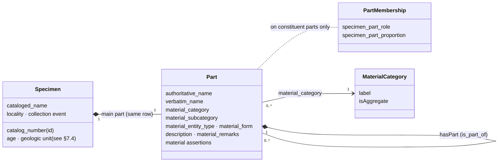

# Compound Specimen Data Model Specification
> 2026-09-24
> compound_specimen_data_model_specification.md
> geoda-transformation-pipeline

How this repository represents a geologic specimen made of several materials — the
**compound specimen** — in its stage files and import datasets: the conceptual model, the
one self-referencing table that carries it, the rules that table must satisfy, how the
pipeline builds it, and where the datasets on disk currently depart from it.

It extends the short draft `compound_specimens_specification.md` (2026-09-16, same folder,
duplicated byte-for-byte in `docs/admin/`), which remains the file
`src/build/build_compound_specimen_sample.py` cites.

---

## Contents

1. [Scope and sources](#1-scope-and-sources)
2. [Terms](#2-terms)
3. [Conceptual model](#3-conceptual-model)
4. [Physical model: one self-referencing table](#4-physical-model-one-self-referencing-table)
5. [Row classification](#5-row-classification)
6. [Identity and reference rules](#6-identity-and-reference-rules)
7. [Attribute placement rules](#7-attribute-placement-rules)
8. [Construction: the compound model transform](#8-construction-the-compound-model-transform)
9. [Encoding patterns in use](#9-encoding-patterns-in-use)
10. [Census of the datasets on disk](#10-census-of-the-datasets-on-disk)
11. [Validation](#11-validation)
12. [Deviations and open decisions](#12-deviations-and-open-decisions)

---

## 1. Scope and sources

**Normative** — where this document and these disagree, these govern:

| Source | What it contributes |
|---|---|
| `schemas/import-schema/import_schema_v1_3_spec.md` §2, §4, §5, §7 | the row model, identity and reference rules, rejection conditions, column semantics |
| `schemas/import-schema/import_schema_dictionary_v1_3.csv` | column list, datatypes, Darwin Core terms |

**Conceptual** — the model the schema serialises:

| Source | What it contributes |
|---|---|
| `docs/supplementals/GCDM.CompoundSpecimenSection_20260903.md` §3 | Geologic Collections Data Model: compound specimen, specimen part, role, proportion, material category, age/unit inheritance |

**Descriptive** — how the repository implements and checks it:

| Source | What it contributes |
|---|---|
| `docs/admin/pipeline_stage_reference.md` | where the compound model transform sits in the stage ladder |
| `docs/transformations/stage_transforms.md` §2 F, §4 | the `expand_parts` operation and the per-dataset recipes |
| `docs/transformations/stage_01_to_03_dataset_changes.md` | what each dataset's part-row step actually did |
| `docs/transformations/dataset_specifications/*` | per-dataset SQL and hand steps (mnbasel, nmbern, mhngeneva) |
| `docs/validations/import_dataset_validations.md` M-01 – M-27 | the validation rules for the relation |
| `src/transform/stage_transforms/operations.py` (`expand_parts`) | construction |
| `src/transform/clear_id_on_part_rows.py`, `src/transform/fill_empty_ids.py`, `src/transform/drop_flagged_rows.py` | identity clean-up |
| every CSV under `data/output/` and `data/dist/` whose header carries `is_part_of` | the evidence in §9 and §10 |

Requirement words **MUST**, **SHOULD**, **MAY** carry their import-schema meaning. Every
figure in §9, §10 and §12 was measured on 2026-09-24 against the files named beside it.

---

## 2. Terms

The import schema's definitions are used throughout. GCDM terms are noted where they differ.

| Term | Definition |
|---|---|
| **specimen** | One catalogued object held by a collection, identified by its catalog number. Comprises one or more parts arranged as a tree. *(schema 2.2)* |
| **catalog number** | The collection's stable identifier for a specimen, unique within the collection. Conveyed in `id` on the specimen row. *(schema 2.3)* |
| **part** | One discernible material of a specimen. Every specimen has at least one. *(schema 2.5)* |
| **main part** | The part carrying the specimen's headline material — the material the object would be named by were it named by one. Described **on the specimen row itself**. *(schema 2.6)* |
| **constituent part** | Any other part, characterised by its role and proportion. *(schema 2.7)* — the GCDM's **specimen part**. |
| **specimen row** | A row whose `is_part_of` is empty. Describes one specimen and its main part. *(schema 2.8)* |
| **part row** | A row whose `is_part_of` is non-empty. Describes one constituent part. *(schema 2.9)* |
| **part tree** | The directed acyclic graph of one specimen's `is_part_of` references, rooted at its specimen row. *(schema 2.10)* |
| **row id** | The value in `id`. On a specimen row it is the catalog number and persists; on a part row it is file-local and discarded after import. *(schema 2.4)* |
| **simple specimen** | A specimen row that no part row references — one part only. |
| **compound specimen** | A specimen row that at least one part row references. |
| **intermediate part** | A part row that another part row references ("parts of parts", GCDM §3.3.1 (4)). |
| **leaf part** | A part row nothing references. |
| **cataloged name** | The name under which the object as a whole is catalogued (`cataloged_name`) — a specimen property, not a part property. |

> **Reconciling the two vocabularies.** The GCDM calls a single quartz crystal a compound
> specimen with one part (GCDM §3.6). The import schema — and this repository — call it a
> **simple specimen**, its one part being the main part on the specimen row. "Compound" in
> this repository is the operational, structural sense of §5: *referenced by a part row*.

---

## 3. Conceptual model



- A **Specimen** has exactly one **main part**, and the pair occupies one row.
- Any part — main or constituent — may have constituent parts, to any depth (schema §4.4).
- **Role** and **proportion** qualify a constituent part's membership of its parent; they are
  meaningless on the main part and a consumer disregards them there (schema §7.4).
- Every part, main or constituent, takes exactly one **material category**, and a parent may
  legitimately differ from its parts — a `Rock` resolving into `Mineral` parts is the ordinary
  case (GCDM §3.2, Figure 6).
- The GCDM's **Specimen Part Relation** (source part → predicate → target part, e.g.
  malachite *after* azurite) and its **preparations** class **have no column in the import
  schema**. The flat file cannot express them; a relation, where held, goes into material
  assertions.

---

## 4. Physical model: one self-referencing table

The whole model is serialised as **one table, one row per part**, with a self-join:

```
parent.id  =  child.is_part_of
```

### 4.1 Columns that carry the model

| Column | Class (schema §4.1) | On a specimen row | On a part row |
|---|---|---|---|
| `id` | identity | **REQUIRED** — the catalog number | empty, unless another row references it (§6) |
| `is_part_of` | identity | **empty** — this alone makes it a specimen row | the parent's `id` |
| `cataloged_name` | specimen property | the object's catalogue name | disregarded |
| `authoritative_name` | part property — **REQUIRED** | the main part's name | the constituent's name |
| `verbatim_name` | part property | the main part's name as in the source | the constituent's name as in the source |
| `material_category` | part property — **REQUIRED** | the main part's category | the constituent's category |
| `material_subcategory` | part property | main part | constituent |
| `specimen_part_role` | specimen part property | disregarded | the constituent's role in its parent |
| `specimen_part_proportion` | specimen part property | disregarded | the constituent's abundance in its parent |
| locality, stratigraphy, age, collection event (§7.2) | specimen properties | read here | **disregarded** (schema §4.6) |
| `material_assertions` | material assertions | against the main part | against the constituent |

### 4.2 The key before and after mapping

The self-join key changes name on the way through the pipeline:

| Where | Parent key | Part rows | Notes |
|---|---|---|---|
| stage 03 / 04 files (`data/output/<code>/`) | `catalog_number` | `catalog_number` **empty**, `is_part_of` = parent's `catalog_number` | a database round-trip adds `uuid` (nmbern, nmstgallen); it is a row key, never the specimen key |
| import datasets (`data/dist/import_datasets/`) | `id` | `id` empty | `apply_import_schema_map.py` maps `catalog_number` → `id` and **coalesces** `id` / `is_part_of` rather than concatenating them |

When several source columns could feed `id`, the one chosen **MUST** be the one the file's own
`is_part_of` values resolve against (validation X-07). mhngeneva's stage 04 carries both a row
ordinal `id` and a `catalog_number`: preferring the ordinal leaves all 875 references pointing
at nothing.

---

## 5. Row classification

`is_part_of` alone decides specimen row versus part row (schema §4.1). Whether a row is
*referenced* further divides each kind into two, giving four classes that **MUST** partition
the file:

| Class | Predicate |
|---|---|
| **Simple specimen** | `id IS NOT NULL AND is_part_of IS NULL AND id NOT IN (SELECT is_part_of …)` |
| **Compound specimen** | `id IS NOT NULL AND is_part_of IS NULL AND id IN (SELECT is_part_of …)` |
| **Intermediate part** | `id IS NOT NULL AND is_part_of IS NOT NULL AND id IN (SELECT is_part_of …)` |
| **Leaf part** | `id IS NULL AND is_part_of IS NOT NULL` |

A row in no class is a defect. It is either an unidentified specimen row (both empty, §11
condition `a`) or a part row carrying an unreferenced `id`. That second case is legal under
schema §4.2 b but is cleared in this repository (§6.2).

"Empty" means absent, zero-length or whitespace only, after trimming (schema §3.4). In SQL,
load empty strings as `NULL` before applying these predicates.

---

## 6. Identity and reference rules

### 6.1 From the import schema (normative)

1. A specimen row **MUST** carry a non-empty `id`, and it is the catalog number. *(§4.2 a)*
2. A part row that another row references **MUST** carry an `id`; any other part row **MAY**
   leave it empty. *(§4.2 b)*
3. `id` values **MUST** be unique across the whole file, specimen and part rows together —
   one namespace, compared case-sensitively after trimming. *(§4.2 c)*
4. `is_part_of` **MUST** equal the `id` of another row **in the same file**. It is never
   resolved against the target collection or another file. *(§4.3 a)*
5. Following `is_part_of` **MUST** terminate at a **specimen row** in finitely many steps. A
   match against *some* `id` is not enough — a chain of part rows satisfies that and reaches
   no specimen. *(§4.3 b)*
6. No self-reference, direct or through a cycle. *(§4.3 c)*
7. Depth is unlimited. *(§4.4)*
8. Row order carries no structure. A part row **MAY** precede its parent, and sibling order
   **SHOULD** be preserved. *(§4.5)*
9. A file describes each specimen **whole**. Re-import replaces the specimen and its entire
   part tree, and a part omitted from the file is deleted. *(§6.2)*

### 6.2 Repository conventions

- **Leaf parts carry no `id`.** `src/transform/clear_id_on_part_rows.py` blanks `id` on every
  part row that nothing references, and refuses (without `--force`) to blank one that is
  referenced. A database round-trip mints ordinals `1, 2, 3…` into `id`, and an ordinal shares
  the catalog-number namespace. It can then collide with a real catalog number and silently
  re-point the graph. This happened to mnbasel on 2026-09-02 (validation M-19).
- **Never derive a part-row `id` from a row ordinal.** If an intermediate part ever needs an
  `id`, use `<catalog_number>.<n>` (schema example `SPEC-3.1`) or a UUID. Either way, the value
  cannot collide with a catalog number.
- **A minted specimen `id` is not a catalog number.** `src/transform/fill_empty_ids.py` fills
  an empty specimen `id` with a surrogate so the file satisfies §4.2 a. Its report records the
  range, and nothing downstream may read such a value as a museum identifier.
- **Catalog numbers are unique per collection, not across the corpus.** mnbasel and nmbern
  share 20,354 compound-specimen ids, both being bare integers. Any product that combines
  datasets **MUST** carry `collection_code` (or `dataset_code`) beside `id`, and **MUST**
  resolve `is_part_of` within one source only. The sample builder
  (`data/dist/products/compound_specimen_sample_dataset_20260915.csv`) does both.

---

## 7. Attribute placement rules

### 7.1 Naming

| Column | Specimen row | Part row |
|---|---|---|
| `cataloged_name` | the object's catalogue name — often the source's own delimited list | **SHOULD** be empty; a consumer discards it |
| `authoritative_name` | the **main part's** name | the constituent's name |
| `verbatim_name` | the main part's name as written in the source | the constituent's name as written |

The draft spec's summary — "compound specimen name in `cataloged_name`, part name in
`authoritative_name`" — is right about where each *object's* name goes. It does not relieve
the specimen row of an `authoritative_name`: the schema makes that column REQUIRED on every
record, because the specimen row also carries the main part. See §12, D-01.

### 7.2 Material category

- **REQUIRED** on every row, specimen and part alike, from the Geological Specimen Material
  Category vocabulary.
- Set independently on each row. **Never** copy a parent's category down to its parts, and
  never overwrite a parent's to match them (validation M-26).
- GCDM Table 3 divides categories into **aggregate** (`Rock`, `Ore`, `Meteorite`,
  `Astromaterial`, `Unconsolidated Material`, `Geological Material`) and **discrete**
  (`Mineral`, `Gemstone`, `Fossil`, `Trace Fossil`, `Interstellar Material`). Only an
  aggregate resolves into parts. So under the GCDM, a compound specimen or intermediate part
  **SHOULD NOT** carry a discrete category (validation M-20, advisory). See §12, D-07.

### 7.3 Role and proportion

`specimen_part_role` and `specimen_part_proportion` belong on part rows only. Recommended
vocabularies:
- **role:** CGI *compound material specimen part role* and GA *Modes of Occurrence* (e.g.
  `matrix`, `phenocryst`, `inclusion`, `vein fill`).
- **proportion:** *Constituent Part Proportion* (`All`, `Major`, `Minor`, `Rare`, `Trace`,
  `Present`, `Variable`, `Absent`), or a percentage.

### 7.4 Specimen properties and inheritance

| Property family | Where it is read | Inheritance (GCDM §3.3–§3.4) |
|---|---|---|
| locality, coordinates, collection date and event | specimen row only | **downward** — every part inherits the specimen's; do not repeat on part rows |
| geologic age, lithostratigraphy, tectonostratigraphy | specimen row only (schema §7.2) | **upward only, and only when every part agrees**; never downward by inference |

> **Schema/GCDM divergence.** The GCDM makes the *part* the canonical home of age and
> geologic unit; the schema offers one slot per specimen. A compound whose parts differ in age
> or unit cannot be expressed in a conforming file. Record the value on the specimen row only
> where the parts agree, and carry a per-part age as a material assertion on the part row
> otherwise (validation M-23).

### 7.5 What is not a part

- **Preparations** — thin sections, polished mounts, powders — are products of an activity,
  not compositional parts. They go in `material_form` or an assertion, never a part row
  (M-22).
- **Associated but unattached objects** — a second piece in the same box, grouping by storage
  location — are not parts. Parts are unified by physical attachment (M-24).
- **Qualifiers** — `radioaktiv`, `auf Quarz`, a locality word — are not materials. A token
  that names no material **MUST NOT** become a part row. See §12, D-05.
- **A part is an instance of a type.** Two sibling parts with the same name and role are one
  part (M-21).

### 7.6 How a specimen is decomposed is the producer's choice

The GCDM (§3.6, Figure 9) gives three equally valid structurings of the same garnet-mica
schist: a single mineral part; two sibling parts (rock, mineral); or a rock part resolved into
its own mineral parts. A validator **MUST NOT** require one shape: that a `Rock` have mineral
parts, that trees be flat, or that every constituent named in the source appear (M-25).

---

## 8. Construction: the compound model transform

### 8.1 Where it sits

The ladder (`docs/admin/pipeline_stage_reference.md`) places the compound model transform
between **stage 03 and stage 04**, after coordinate conversion. In practice mhngeneva, mnbasel
and nmbern ran it between **02 and 03**. That disagreement is open (§12, D-11), so a "stage 03"
cannot be compared across datasets on this point.

### 8.2 The algorithm

The ladder's manual procedure, originally run in Easy Data Transform, and the generic
`expand_parts` operation (`src/transform/stage_transforms/operations.py`) implement the same
steps:

1. Take a delimited multi-value column on each specimen row, e.g. `Quarz, Wulfenit`.
2. Split it on the delimiter. Optionally strip or discard tokens and split each token further
   into two columns (e.g. `Magmatit/Plutonit` → `material_subcategory` / `authoritative_name`).
3. For each token, **append** one part row carrying only:
   - `is_part_of` = the specimen's `catalog_number`;
   - the token in the name column (`authoritative_name` by default, case-normalised on
     request);
   - the recipe's constants, typically `material_category`;
   - any columns the recipe copies from the parent.
4. Leave every specimen row in place, in its order. A row with a blank key yields no parts and
   is counted.
5. Repeat for each multi-value column (nmbern runs it three times: minerals, rock, ore).

`expand_parts` parameters: `source`, `delimiter` (regex; null = whole value is one part),
`key`, `parent_ref`, `name_column`, `name_case`, `constants`, `copy`, `discard_tokens`,
`strip_chars` / `lstrip_chars` / `rstrip_chars`, `value_split`, `clear_source`.

### 8.3 Per-dataset recipes

| Dataset | Source column | Delimiter | Part `material_category` | Specimen row keeps | Post-steps |
|---|---|---|---|---|---|
| mhngeneva | `minerals_list` | `,` (title-cased) | `Mineral` (asserted) | its own `authoritative_name`; the list | `cataloged_name` = `authoritative_name`; ids padded to `NNN.DDD` in both columns; `clear_id_on_part_rows` |
| mnbasel | `mineral_list` | `,\s+` | `Mineral` | the list in `cataloged_name` (filled in MySQL); `authoritative_name` empty | — |
| mnbasel | `rock_type` | whole value, split once on `/` | `Rock`, `material_subcategory` from the prefix | — | — |
| nmbern | `minerals_list` | `,` (leading `- ` stripped, bare `-` discarded) | `Mineral` | the list | MySQL: single-part compounds folded back into simple specimens; `cataloged_name` / `authoritative_name` / `material_category` set per `is_mineral` / `is_ore` / `is_rock`; `is_ignored` rows dropped |
| nmbern | `rock_name` | whole value | `Rock` | — | as above |
| nmbern | `ore_class_name` | whole value | `Ore` | — | as above |
| nmstgallen | `mineral_list` | `,` | `Mineral` | the list in `cataloged_name`; `authoritative_name` empty | — |
| ch_meteorites, natureum_igneous | — | — | — | — | not run: no multi-value material column, so every row is a simple specimen |

The nmbern post-steps are recorded as SQL in
`docs/transformations/dataset_specifications/nmbern_stage_03_transformations_20260914.md`.
The folded single-part records are listed in
`data/output/nmbern/nmbern_stage_03_single_part_minerals.tsv`. Stage 04 is stage 03 minus the
`is_ignored` rows (`drop_flagged_rows.py`), which kept the part rows of dropped parents and
listed them (§12, D-04).

---

## 9. Encoding patterns in use

Three patterns for the specimen row of a compound are on disk. Only **A** matches the schema
as written.

### Pattern A — main part on the specimen row (mhngeneva)

The specimen row names its headline material; the part rows carry the *other* materials.

| `id` | `is_part_of` | `cataloged_name` | `authoritative_name` | `material_category` |
|---|---|---|---|---|
| 404.004 | | Titanite | Titanite | Mineral |
| | 404.004 | *(Chlorite)* | Chlorite | Mineral |
| | 404.004 | *(Albite)* | Albite | Mineral |

Conforms to schema §2.6 and §4.1. The main name is repeated as a part in only 1 of 571
compounds. The italic `cataloged_name` on part rows is surplus, and a consumer discards it
(§12, D-09).

### Pattern B — container specimen row (mnbasel, nmstgallen)

The specimen row holds the source's delimited list as its `cataloged_name` and **no**
`authoritative_name`; every token, including the headline one, becomes a part row.

| `id` | `is_part_of` | `cataloged_name` | `authoritative_name` | `material_category` |
|---|---|---|---|---|
| 22783 | | Quarz, Wulfenit | | Mineral |
| | 22783 | | Wulfenit | Mineral |
| | 22783 | | Quarz | Mineral |

The specimen row's main part has no material, which violates the schema's REQUIRED
`authoritative_name` (validation M-15 / Q-01). A single-token list produces a compound with one
part that the schema would write as a simple specimen. mnbasel has 34,345 of these and
nmstgallen 890.

### Pattern C — main part on the specimen row *and* repeated as a part (nmbern stage 04)

The MySQL post-steps set the specimen row's `authoritative_name` to the first mineral, but
left that mineral's part row in place.

| `catalog_number` | `is_part_of` | `cataloged_name` | `authoritative_name` | `material_category` |
|---|---|---|---|---|
| 31986 | | Turmalin | Turmalin | *(empty)* |
| | 31986 | | Turmalin | Mineral |
| | 31986 | | allgemein Orthoklas | Mineral |
| | 31986 | | Adular | Mineral |

The main part is described twice, in 22,242 of 23,496 compounds, and `material_category` is
empty on 22,264 compound specimen rows. Single-part compounds, by contrast, were folded back
into simple specimens, so nmbern is the only dataset with none.

---

## 10. Census of the datasets on disk

The current import dataset for each code, plus nmbern's stage 04 (no nmbern import dataset
has been built):

| Dataset | File | Rows | Specimen rows | Part rows | Compound | Simple | 1-part compounds | Max parts | Depth | Pattern |
|---|---|---:|---:|---:|---:|---:|---:|---:|---:|---|
| ch_meteorites | `ch_meteorites_import_dataset_20260916.csv` | 7,616 | 7,616 | 0 | 0 | 7,616 ¹ | — | — | 0 | — |
| mhngeneva | `mhngeneva_import_dataset_20260916.csv` | 22,173 | 21,298 | 875 | 571 | 20,727 | 364 ² | 5 | 1 | A |
| mnbasel | `mnbasel_import_dataset_20260916.csv` | 112,624 | 46,289 | 66,335 | 45,647 | 642 | 34,345 | 11 | 1 | B |
| natureum_igneous | `natureum_igneous_import_dataset_20260916.csv` | 787 | 787 | 0 | 0 | 787 | — | — | 0 | — |
| nmstgallen | `nmstgallen_import_dataset_20260916.csv` | 2,617 | 1,161 | 1,456 | 1,161 | 0 | 890 | 4 | 1 | B |
| nmbern | `data/output/nmbern/nmbern_stage_04_20260915.csv` | 113,121 | 44,923 | 68,198 | 23,496 | 21,427 | 0 | 21 | 1 | C |

¹ 404 `id` values are shared by 965 rows — schema condition `b` (duplicate row id), unrelated
to the compound relation but rejected all the same.
² Under pattern A a one-part compound is two materials (main + one constituent), not the
degenerate case it is under B.

The following held in every file:

| Property | Result |
|---|---|
| Part rows carrying an `id` | 0 |
| Intermediate parts | 0 — no dataset nests; depth is always 1 |
| `is_part_of` resolving to a specimen row | 100%, except nmbern's 69 orphans (22 parents) |
| `specimen_part_role`, `specimen_part_proportion` populated | never |
| Locality or coordinates repeated on part rows | never |

The two stage-level ancestors show the same shapes keyed on `catalog_number`: mnbasel stage
03/04 at 112,624 rows, and nmbern stage 03 at 134,580 rows before the fold and drop.

---

## 11. Validation

### 11.1 Rejection conditions (schema §5)

A consumer rejects, and the pipeline **SHOULD** report with the same letters:

| Code | Condition |
|---|---|
| `a` | unidentified specimen row — `id` and `is_part_of` both empty |
| `b` | duplicate row id — **every** row bearing it |
| `c` | unrooted part row — chain reaches no specimen row: absent target, self-reference, cycle, or chain of part rows |
| `d` | vacuous part row — every §7.3 part property empty |
| `p` | propagated — the row's chain passes through a rejected row, to any depth |

Rejection is local (schema §5.3): a bad row never rejects the file, or a conforming specimen.

### 11.2 Checks to run on every build

```sql
-- census: the four classes must sum to the row count (M-16)
SELECT
  SUM(is_part_of IS NULL AND id IS NOT NULL AND id NOT IN (SELECT is_part_of FROM t WHERE is_part_of IS NOT NULL)) AS simple,
  SUM(is_part_of IS NULL AND id IS NOT NULL AND id IN     (SELECT is_part_of FROM t WHERE is_part_of IS NOT NULL)) AS compound,
  SUM(is_part_of IS NOT NULL AND id IS NOT NULL AND id IN (SELECT is_part_of FROM t WHERE is_part_of IS NOT NULL)) AS intermediate,
  SUM(is_part_of IS NOT NULL AND id IS NULL) AS leaf,
  COUNT(*) AS total
FROM t;

-- termination, not just linkage (M-17): every part row must reach a specimen row.
-- row_ord is the row's 1-based ordinal in the source file (schema §4.5).
WITH RECURSIVE chain(start_row, cur, depth) AS (
  SELECT row_ord, is_part_of, 1 FROM t WHERE is_part_of IS NOT NULL
  UNION ALL
  SELECT c.start_row, p.is_part_of, c.depth + 1
  FROM chain c JOIN t p ON p.id = c.cur
  WHERE p.is_part_of IS NOT NULL AND c.depth < 64          -- bound it; §4.4 sets no limit
)
SELECT DISTINCT start_row, 'c: ends at a missing or non-specimen row' AS reason
FROM chain c
WHERE NOT EXISTS (SELECT 1 FROM t p WHERE p.id = c.cur AND p.is_part_of IS NOT NULL)  -- chain stops here
  AND NOT EXISTS (SELECT 1 FROM t s WHERE s.id = c.cur AND s.is_part_of IS NULL)      -- ...not at a specimen row
UNION
SELECT DISTINCT start_row, 'c: self-reference or cycle (hit depth bound)'
FROM chain WHERE depth = 64;

-- duplicate siblings (M-21)
SELECT is_part_of, authoritative_name, specimen_part_role, COUNT(*)
FROM t WHERE is_part_of IS NOT NULL
GROUP BY 1, 2, 3 HAVING COUNT(*) > 1;
```

Also check:
- no part row carries an unreferenced `id` (§6.2);
- `cataloged_name`, locality and age are empty on part rows;
- `authoritative_name` and `material_category` are non-empty on **every** row, specimen rows
  included;
- no compound specimen carries a discrete category (M-20, advisory).

The full rule set, with detection status per dataset, is
`docs/validations/import_dataset_validations.md` M-01 – M-27.

---

## 12. Deviations and open decisions

Numbered for reference. **Decision** marks a choice for the project, not a mechanical fix.

| # | Kind | Deviation | Where | Scale |
|---|---|---|---|---|
| **D-01** | Decision | Container specimen rows: no `authoritative_name` on the specimen row, so the main part is undescribed (schema §7.3 REQUIRED; M-15). Fix is to choose a main part (e.g. the first token, as nmbern did) **and remove its part row**, or to name the whole with a rock/aggregate term. | mnbasel, nmstgallen | 45,647 + 1,161 specimen rows |
| **D-02** | Decision | One-part compounds under pattern B — a specimen and a single part describing the same material. nmbern folded these into simple specimens; mnbasel and nmstgallen did not. | mnbasel, nmstgallen | 34,345 + 890 |
| **D-03** | Fix | Main part described twice (specimen row and a part row), and `material_category` empty on compound specimen rows. | nmbern stage 04 | 22,242 duplicated; 22,264 empty categories |
| **D-04** | Fix | Orphan part rows: parents dropped as `is_ignored`, parts kept → condition `c`. Regenerate stage 04 with `drop_flagged_rows --drop-orphaned-parts`, or accept knowingly. | nmbern stage 04 | 69 rows, 22 parents |
| **D-05** | Fix | Tokens that are not materials became parts: `radioaktiv` (27 part rows), and unsplit `X mit Y` / `X und Y` / `X auf Y` names in nmstgallen; `Gestein <country>` placeholders in mnbasel, some categorised `Mineral`. The nmstgallen delimiter decision (`stage_transforms_open_issues.md` §2) was bypassed by splitting on the comma alone. | nmstgallen, mnbasel | 27+ / 322 part rows |
| **D-06** | Fix | Duplicate sibling parts (same name under one parent) — a split without de-duplication (M-21). | mnbasel, nmbern | 16 / 216 parents |
| **D-07** | Decision | Compound specimens carrying the discrete category `Mineral` — under the GCDM a mineral cannot have parts (M-20). Options: accept (a mineral specimen with associated minerals is catalogued as a mineral), or categorise the whole `Geological Material` / `Rock`. | mhngeneva, mnbasel, nmstgallen | 571 / 45,332 / 1,161 |
| **D-08** | Gap | Role and proportion never populated; no nesting produced anywhere. nmbern's `mode_of_occurrence` (`Kluftmineral`, `im Entstehungsverband`) is the one source column that could feed `specimen_part_role` — it was first mis-mapped to `is_part_of`. | all | — |
| **D-09** | Fix | `cataloged_name` repeated on part rows, where a consumer discards it (Q-07, X-04). | mhngeneva | 875 rows |
| **D-10** | Decision | Age and geologic unit: specimen-level in the schema, part-level in the GCDM (§7.4). Not yet biting — no part row carries either — but nmbern, with the most parts and a full stratigraphy set, is where it will. | nmbern | — |
| **D-11** | Decision | Stage numbering: the ladder puts the compound transform at 03 → 04; three datasets did it at 02 → 03 (`stage_transforms_open_issues.md` §1). | mhngeneva, mnbasel, nmbern | — |
| **D-12** | Docs | `import_dataset_validations.md` (2026-09-03) still reports mnbasel's part structure as void (M-17, M-19: row-ordinal ids, depth 31). The 2026-09-16 build fixed it: 66,335 of 66,335 part rows resolve to a specimen row at depth 1, no part row carries an `id`. Its census table and those two findings are stale. | docs | — |

